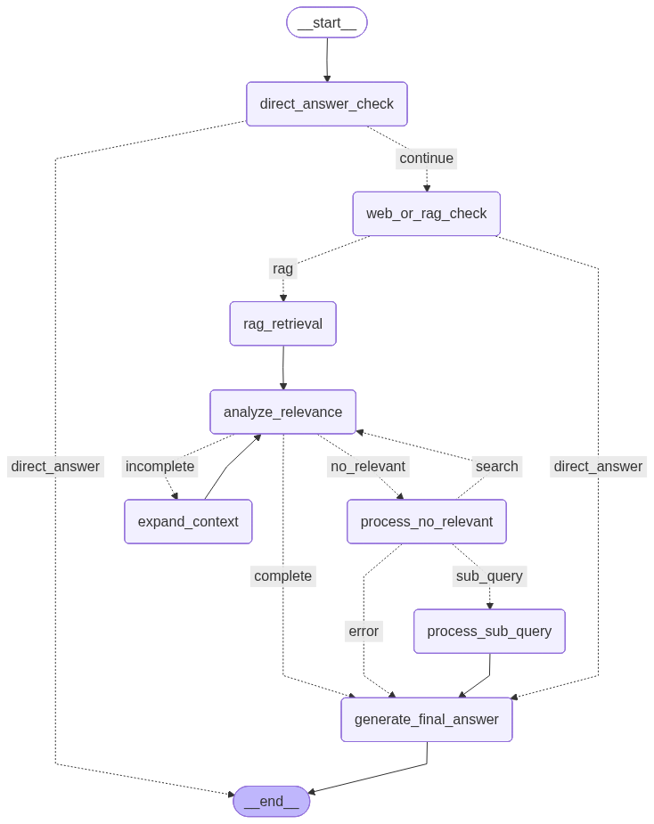
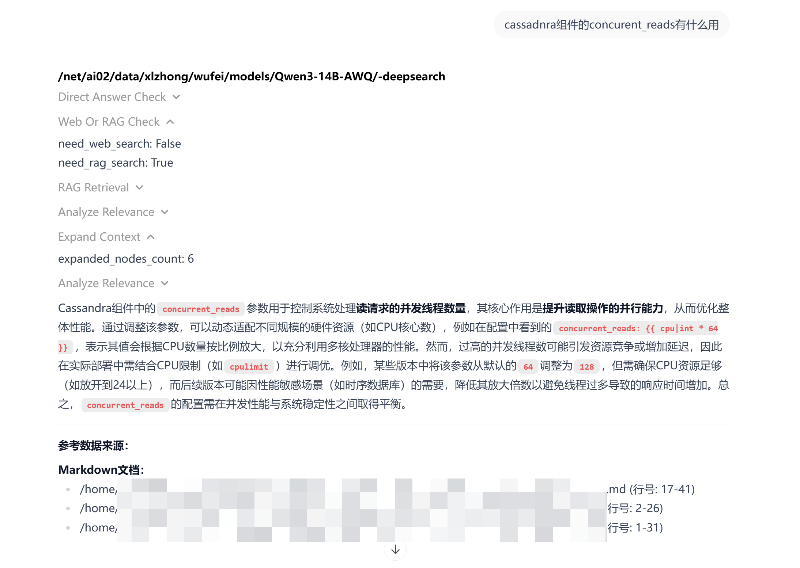
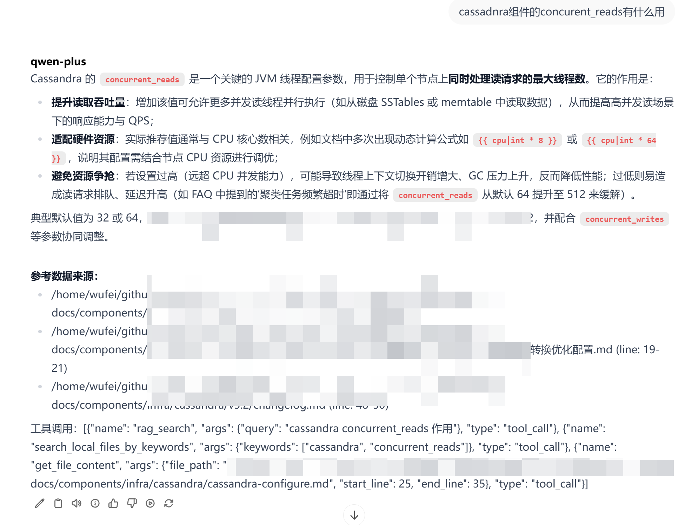

# AskAny

[中文版](README_CN.md) | English

A Chinese-optimized RAG (Retrieval-Augmented Generation) QA assistant for operations, development, and testing teams.

> 📖 **Blog Post**: [AskAny: An Intelligent Q&A Assistant for DevOps Teams](https://zhuanlan.zhihu.com/p/2004009140419310603) (Chinese) - Detailed introduction to project background, technology choices, and architecture design

## Architecture Overview

### Manual Workflow Mode



**Example Response in OpenWebUI:**



### Automatic Agent Mode


**Example Response in OpenWebUI:**



### Output Structure

AskAny's responses in OpenWebUI consist of three core components:

1. **Tool Call Flow**
   - Displays the sequence of tool invocations during agent execution
   - Shows the usage of each tool (RAG retrieval, web search, local file search, etc.)
   - Helps users understand how the system progressively gathers information to answer questions

2. **Summary Answer**
   - The final answer generated based on retrieved information
   - Integrates results from multiple retrieval rounds and tool calls
   - Provides clear and accurate response content

3. **Reference Documents**
   - Lists the source documents used to generate the answer
   - Includes metadata such as document titles and source paths
   - Enables users to trace answer sources and verify information reliability

This structured output format ensures traceability and transparency, allowing users to clearly understand how the system gathers information and generates answers.

## Features

- **Workflow Agent**: LangGraph-based multi-stage agent workflow to reduce hallucination
- **Hybrid Retrieval**: Combines keyword search and vector search with reranking
- **Multi-modal Support**: Text + image support via OpenWebUI integration
- **Chinese Optimization**: HanLP TF-IDF, zhparser for PostgreSQL
- **Dual Workflow Modes**: Manual workflow (more stable and detailed, ~60s) and automatic agent (faster, ~30s)
- **FAQ Tag Filtering**: Support for @tag metadata filtering
- **vLLM Integration**: Fast inference with OpenAI-compatible API

## Technology Stack

| Component | Technology |
|-----------|------------|
| Workflow Engine | LangGraph (state machine for agent orchestration) |
| RAG Framework | LlamaIndex (retrieval and query engines) |
| API Layer | FastAPI + LangServe (OpenAI-compatible endpoints) |
| Vector Store | PostgreSQL + pgvector with HNSW indexing |
| Embedding | BAAI/bge-m3 (multilingual, 1024-dim) |
| Reranker | BAAI/bge-reranker-v2-m3 (multilingual) |
| LLM | vLLM-served models (default: Qwen) |
| Frontend | OpenWebUI (chat interface) |

## Architecture

```
User Query (OpenWebUI)
    ↓
FastAPI Server (askany/api/server.py)
    ↓
┌─────────────────────────────────────────────────────┐
│  Workflow Mode Selection                            │
│  ├── min_langchain_agent.py (LangChain Agent)      │
│  └── workflow_langgraph.py (LangGraph State Machine)│
└─────────────────────────────────────────────────────┘
    ↓
WorkflowFilter (workflow_filter.py) - Pre-filters simple queries
    ↓
QueryRouter (rag/router.py) - Routes to FAQ/DOCS engines
    ↓
┌─────────────────────────────────────────────────────┐
│  RAG Engines                                        │
│  ├── FAQQueryEngine (hybrid: keyword + vector)     │
│  └── RAGQueryEngine (documentation retrieval)      │
└─────────────────────────────────────────────────────┘
    ↓
VectorStoreManager (PostgreSQL + pgvector)
    ↓
Response with References
```

### Workflow Modes

**1. Manual Workflow (`workflow_langgraph.py`)**
- Manually designed LangGraph state machine with explicit orchestration
- Iterative context expansion with controlled retrieval rounds
- Sub-problem decomposition for complex queries
- More stable and detailed responses (~60s average)
- Best for: Complex queries requiring thorough analysis and multiple retrieval rounds

**2. Automatic Agent (`min_langchain_agent.py`)**
- LangChain agent with automatic tool selection (RAG, web search, local file search)
- Flexible and adaptive tool usage based on query needs
- Faster response time (~30s average)
- Best for: Queries requiring diverse information sources and quick responses

## Quick Start

### Installation

```bash
# Install Python 3.11 and dependencies
uv python install 3.11
uv python pin 3.11
uv tool install ruff
uv sync

# Configure environment
cp .env.example .env
# Edit .env with database credentials and API endpoints
```

### Database Setup

```bash
# Quick setup (recommended)
sudo bash setup_postgresql.sh

# Or manual setup
createdb askany
psql -d askany -c "CREATE EXTENSION IF NOT EXISTS vector;"
```

### Document Ingestion

AskAny supports two document formats:

**1. FAQ Format (JSON)**

Place FAQ files in `data/json/`. Each FAQ entry should follow this structure:

```json
{
  "question": "What is the default port for the API server?",
  "answer": "The default port is 8000. You can change it by setting api_port in config.py or the API_PORT environment variable.",
  "metadata": {
    "tag": "configuration",
    "category": "api"
  }
}
```

**2. Markdown Format**

Place documentation files in `data/markdown/`. Standard markdown files are supported.

**Ingestion Commands:**

```bash
# Ingest all documents from data/json and data/markdown
python -m askany.main --ingest

# Check ingested data
python -m askany.main --check-db
```

### Running the Server

```bash
# Start API server (default: http://0.0.0.0:8000)
python -m askany.main --serve

# Server provides:
# - OpenAI-compatible chat endpoint: POST /v1/chat/completions
# - OpenAPI schema: GET /openapi.json
# - FAQ hot update: POST /v1/update_faqs
# - Health check: GET /health
```

### Testing Queries

```bash
# Direct query test
python -m askany.main --query --query-text "your question" --query-type AUTO

# Query types: AUTO (smart routing), FAQ, DOCS
```

## Project Structure

```
askany/
├── api/                    # FastAPI server and endpoints
│   └── server.py          # Main API server
├── config.py              # Centralized configuration
├── ingest/                # Document ingestion
│   ├── vector_store.py    # PostgreSQL + pgvector management
│   ├── json_parser.py     # FAQ JSON ingestion
│   └── markdown_parser.py # Markdown document parsing
├── prompts/               # Centralized prompt management
│   ├── prompts_cn.py      # Chinese prompts
│   ├── prompts_en.py      # English prompts
│   └── prompt_manager.py  # Language-aware prompt manager
├── rag/                   # RAG components
│   ├── router.py          # Query routing logic
│   ├── faq_query_engine.py    # FAQ hybrid retrieval
│   └── rag_query_engine.py    # Documentation retrieval
├── workflow/              # Agent workflows
│   ├── workflow_langgraph.py  # LangGraph state machine
│   ├── min_langchain_agent.py # LangChain agent
│   ├── workflow_filter.py     # Pre-filter for simple queries
│   └── ...                    # Supporting modules
└── main.py                # Entry point
```

### Utilities and Scripts

The project includes utility scripts in `tool/` and test files in `test/`:

**Tool Scripts (`tool/`):**
- `export_vector_data.py` - Export vector data from PostgreSQL to files (supports pg_dump custom format or separate schema/data files)
- `import_vector_data.py` - Import vector data from files back to PostgreSQL
- `ingest_check.py` - Verify ingested data in the database
- `query_test.py` - Test queries directly
- Other utility scripts for data migration, keyword export, and HNSW index inspection

**Test Files (`test/`):**
- `test_workflow_client_call.py` - Workflow client tests
- Various test scripts for components and integrations

**Common Commands:**

See `dev_readme/script.sh` for commonly used commands including:
- Document ingestion with proper encoding
- Server startup
- Database data checks
- HNSW index inspection
- Vector data export/import

Example usage:
```bash
# Export vector data
python tool/export_vector_data.py --output-dir vector_data --format full

# Import vector data
python tool/import_vector_data.py --input-dir vector_data --drop-existing

# Check ingested data
python tool/ingest_check.py
```

## Configuration

All settings can be configured in `askany/config.py` or via environment variables in `.env`.

### Core Settings

| Setting | Description | Default |
|---------|-------------|---------|
| `language` | Prompt language (cn/en) | cn |
| `device` | Compute device (cuda/cpu) | cuda |
| `log_level` | Logging level | DEBUG |

### LLM Settings

| Setting | Description | Default |
|---------|-------------|---------|
| `openai_api_base` | LLM API endpoint | dashscope.aliyuncs.com |
| `openai_api_key` | API key (set in .env) | - |
| `openai_model` | LLM model name | qwen-plus |
| `temperature` | Generation temperature | 0.2 |
| `top_p` | Top-p sampling | 0.8 |
| `llm_max_tokens` | Max tokens for LLM | 40000 |
| `llm_timeout` | LLM timeout (seconds) | 700 |

### Database Settings

| Setting | Description | Default |
|---------|-------------|---------|
| `postgres_host` | PostgreSQL host | localhost |
| `postgres_port` | PostgreSQL port | 5432 |
| `postgres_user` | Database user | root |
| `postgres_password` | Database password | 123456 |
| `postgres_db` | Database name | askany |
| `faq_vector_table_name` | FAQ vector table | askany_faq_vectors |
| `docs_vector_table_name` | Docs vector table | askany3_docs_vectors |

### Embedding & Reranker

| Setting | Description | Default |
|---------|-------------|---------|
| `embedding_model` | Embedding model | BAAI/bge-m3 |
| `embedding_model_type` | Model type | sentence_transformer |
| `embedding_local_files_only` | Offline mode | False |
| `vector_dimension` | Vector dimension | 1024 |
| `reranker_model` | Reranker model | BAAI/bge-reranker-v2-m3 |
| `reranker_local_files_only` | Offline mode | False |

### Retrieval Settings

| Setting | Description | Default |
|---------|-------------|---------|
| `faq_similarity_top_k` | FAQ top-k results | 3 |
| `faq_rerank_candidate_k` | FAQ rerank candidates | 10 |
| `faq_score_threshold` | FAQ score threshold | 0.75 |
| `faq_ensemble_weights` | [keyword, vector] weights | [0.5, 0.5] |
| `docs_similarity_top_k` | Docs top-k results | 5 |
| `docs_rerank_candidate_k` | Docs rerank candidates | 10 |
| `docs_similarity_threshold` | Docs score threshold | 0.6 |
| `docs_ensemble_weights` | [keyword, vector] weights | [0.5, 0.5] |

### HNSW Index Settings

| Setting | Description | Default |
|---------|-------------|---------|
| `enable_hnsw` | Enable HNSW index | True |
| `hnsw_m` | Bi-directional links | 16 |
| `hnsw_ef_construction` | Construction candidate list | 128 |
| `hnsw_ef_search` | Search candidate list | 40 |
| `hnsw_dist_method` | Distance method | vector_cosine_ops |

### Agent Workflow Settings

| Setting | Description | Default |
|---------|-------------|---------|
| `agent_max_iterations` | Max workflow iterations | 3 |
| `enable_web_search` | Enable web search | True |
| `web_search_api_url` | Web search API endpoint URL | http://localhost:8800/search |
| `query_rewrite_bool` | Enable query rewriting | True |
| `expand_context_ratio` | Context expansion ratio | 1.0 |

### Data Paths

| Setting | Description | Default |
|---------|-------------|---------|
| `json_dir` | FAQ JSON directory | data/json |
| `markdown_dir` | Markdown docs directory | data/markdown |
| `local_file_search_dir` | Local search directory | data/markdown |
| `storage_dir` | Keyword index storage | key_word_storage |

### Customizing Prompts for Your Knowledge Base

The prompts in `askany/prompts/prompts_cn.py` (Chinese) and `askany/prompts/prompts_en.py` (English) contain `TODO` placeholders that should be customized for each knowledge base deployment.

## API Endpoints

| Endpoint | Method | Description |
|----------|--------|-------------|
| `/health` | GET | Health check |
| `/openapi.json` | GET | OpenAPI specification |
| `/v1/chat/completions` | POST | OpenAI-compatible chat |
| `/v1/update_faqs` | POST | Hot update FAQ entries |

## Development

### Code Quality

```bash
# Format code with ruff
ruff format .

# Lint code
ruff check .

# Fix auto-fixable issues
ruff check --fix .
```

### Common Commands

For frequently used commands, see `dev_readme/script.sh`. Key operations include:

```bash
# Document ingestion (with proper encoding)
PYTHONIOENCODING=utf-8 LC_ALL=en_US.UTF-8 NO_COLOR=1 TERM=dumb python -u -m askany.main --ingest > ingest.log 2>&1

# Start server
PYTHONIOENCODING=utf-8 LC_ALL=en_US.UTF-8 NO_COLOR=1 TERM=dumb python -u -m askany.main --serve > serve.log 2>&1

# Check database data counts
PGPASSWORD=123456 psql -h localhost -U root -d askany -c "SELECT 'data_askany_faq_vectors' as table_name, COUNT(*) as row_count FROM data_askany_faq_vectors UNION ALL SELECT 'data_askany_docs_vectors', COUNT(*) FROM data_askany_docs_vectors;"

# Export/import vector data
python tool/export_vector_data.py --output-dir vector_data
python tool/import_vector_data.py --input-dir vector_data --drop-existing
```

### Adding New Document Types

1. Create parser in `askany/ingest/`
2. Update `ingest_documents()` in `askany/ingest/ingest.py`
3. Consider metadata schema for filtering

## Roadmap

See [roadmap.md](roadmap.md) for planned features and improvements.

## Deployment

### OpenWebUI Integration

AskAny can be integrated with OpenWebUI for a web-based chat interface.

**Setup Steps:**

1. Clone the OpenWebUI repository:
```bash
git clone https://github.com/wufei-png/open-webui.git
cd open-webui
git checkout wf/dev  # Use the custom branch
```

Then follow the instructions to deploy OpenWebUI, refer to the [OpenWebUI Development Documentation](https://docs.openwebui.com/getting-started/advanced-topics/development/).

My deployment operations are:
- the frontend: ```npm run dev```
- the backend(in conda or uv env): ```cd backend && ENABLE_OLLAMA_API=False BYPASS_EMBEDDING_AND_RETRIEVAL=true ./dev.sh```

### Web Search Service

AskAny supports web search functionality via the [Proxyless LLM WebSearch](https://github.com/wufei-png/proxyless-llm-websearch/tree/wf/company) service.

**Setup Steps:**

1. Clone the web search service repository:
```bash
git clone https://github.com/wufei-png/proxyless-llm-websearch.git
cd proxyless-llm-websearch
git checkout wf/company  # Use the custom branch
```

2. Configure environment (if needed):
```bash
cp .env.example .env
# Edit .env to configure search engine API keys, etc.
```

4. Start the web search API server:
```bash
# Start the API server
python agent/api_serve.py
```

The service will start on `http://localhost:8800` by default. The search endpoint is available at `http://localhost:8800/search`.

6. Configure AskAny to use the web search service:
   - **Default**: The web search API URL is configured in `askany/config.py` as `web_search_api_url` (default: `http://localhost:8800/search`)

**Note**: Make sure the web search service is running before starting AskAny, or web search functionality will be unavailable.

## Related Resources

- [Proxyless LLM WebSearch](https://github.com/wufei-png/proxyless-llm-websearch/tree/wf/company)
- [OpenWebUI](https://github.com/wufei-png/open-webui/tree/wf/dev)

## Star History

[](https://star-history.com/#wufei-png/AskAny&Date)

## License

MIT
